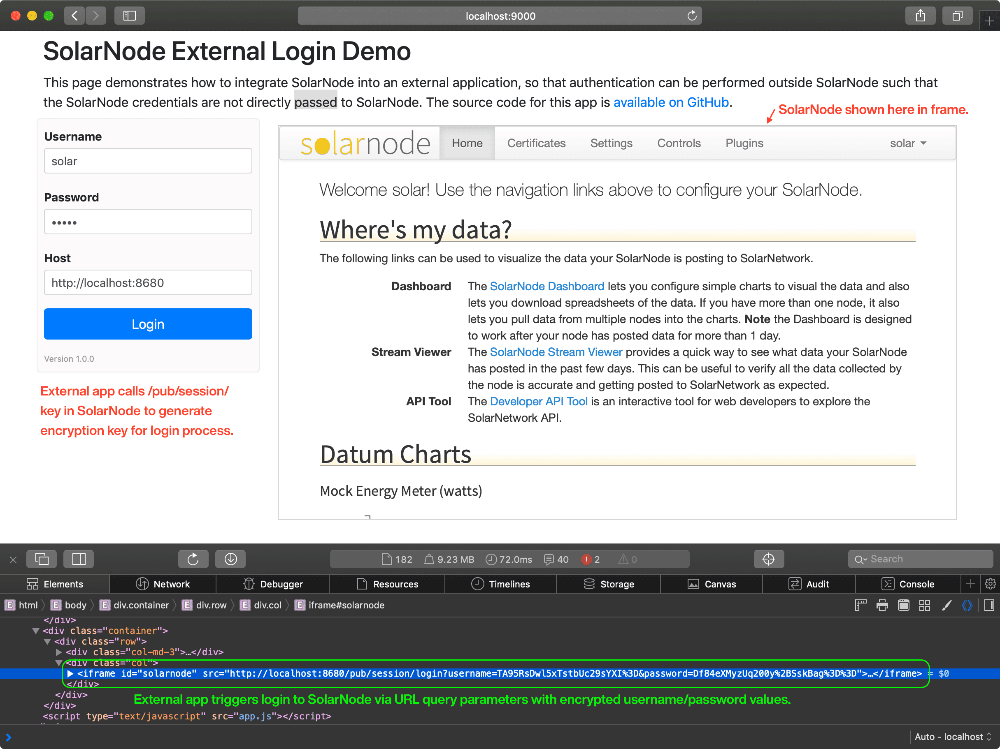

# SolarNode External Login Demo

This project contains a webapp that demonstrates how to integrate an external application with
the SolarNode login API, so that the login credentials can be managed by the external application
and used to authenticate to the SolarNode application progamatically.



# Use

Fill in a valid SolarNode username, password, and host, then click the **Login** button. This will
authenticate with SolarNode and load the logged-in SolarNode home screen inside a frame within the
demo main window.

# Building

The build uses [NPM][npm] or [Yarn][yarn]. First, initialize the dependencies:

```shell
# NPM
npm install

# or, Yarn
yarn install
```

Then, the development web server can be started via

```shell
# NPM
npm run start

# or, Yarn
yarn run start
```

and then the app can be reached at [localhost:9000](http://localhost:9000). For a
produciton build, use

```shell
# NPM
npm run build -- --config webpack.prod.js

# or, Yarn
yarn run build --config webpack.prod.js
```

and the app will be built in the `dist` directory.

[npm]: https://www.npmjs.com/
[yarn]: https://yarnpkg.com/
